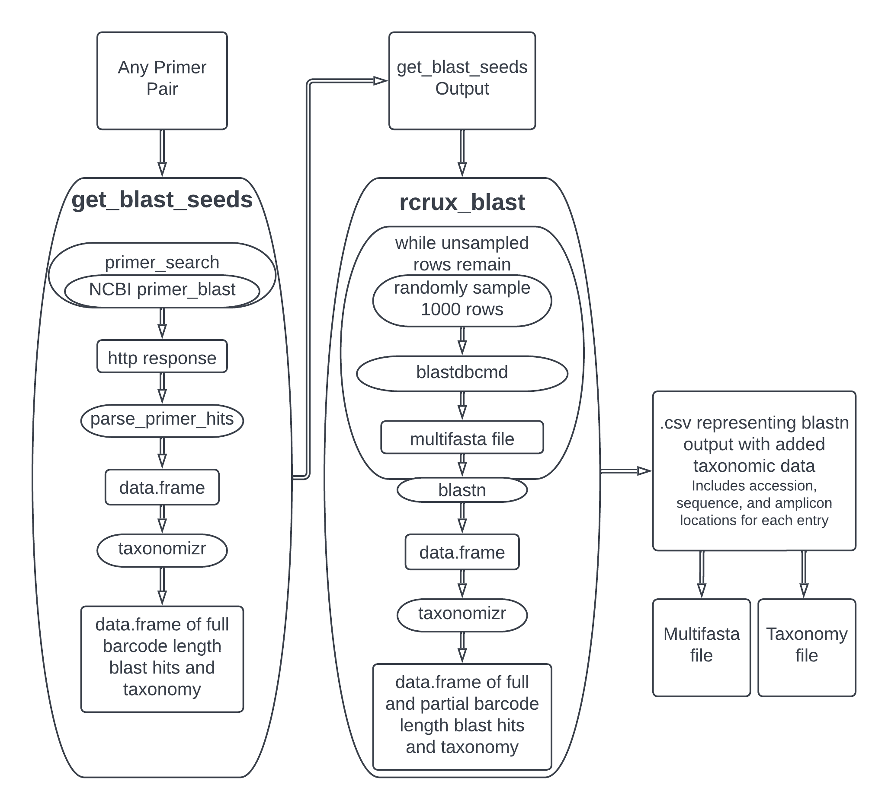

# rCRUX: Generate CRUX metabarcoding reference libraries in R


**Authors:** [Luna Gal](<galoscarleo@gmail.com>), [Zachary Gold](zack.gold@ucla.edu), [Emily Curd](eecurd@g.ucla.edu)<br/>
**License:**
[GPL-3](https://opensource.org/licenses/GPL-3.0)


eDNA metabarcoding is increasingly used to survey biological communities using common universal and novel genetic loci. There is a need for an easy to implement computational tool that can generate metabarcoding reference libraries for any locus, and are specific, and comprehensive. We have reimagined CRUX (Curd et al. 2019) and developed the rCRUX package to fit this need by generating taxonomy and miltifasta files for any user defined locus.  The typical workflow involves using get_blast_seeds() to download and wrangle results from NCBI’s primer BLAST tool, then using rcrux_blast() to search a local NCBI database for matches.


## Typical Workflow




## Installation

Install from GitHub:

``` r
# install.packages(devtools)
devtools::install_github("LunaGal/rCRUX")
```

``` r
library(rCRUX)
```

## Dependencies

**BLAST+**

NCBI's [BLAST+](ftp://ftp.ncbi.nlm.nih.gov/blast/executables/blast+/) suite must be locally installed and accessible in the user's path. NCBI provides installation instructions for [Windows](https://www.ncbi.nlm.nih.gov/books/NBK52637/), [Linux](https://www.ncbi.nlm.nih.gov/books/NBK52640/), and [Mac OS](https://www.ncbi.nlm.nih.gov/books/NBK569861/). Version 2.10.1+ is verified compatible with rCRUX.

**Blast-formatted database**

rCRUX requires a local blast-formatted nucleotide database. These can be user generated or download a pre-formatted database from [NCBI](ftp://ftp.ncbi.nlm.nih.gov/blast/executables/blast+/LATEST/)  NCBI provides a tool for downloading databases as part of the blast+ package. A brief help page can be found [here](https://www.ncbi.nlm.nih.gov/books/NBK569850/).

**Taxonomizr**

rCRUX uses the [taxonomizr](https://cran.r-project.org/web/packages/taxonomizr/vignettes/usage.html) package for taxonomic assignment based on NCBI [Taxonomy id's \(taxids\)](https://www.ncbi.nlm.nih.gov/). Many rCRUX functions require a path to a local taxonomizr readable sqlite database. This database can be built using taxonomizr's [prepareDatabase](https://www.rdocumentation.org/packages/taxonomizr/versions/0.8.0/topics/prepareDatabase) function.


# Example pipeline

The following example shows a simple RCRUX pipeline from start to finish. Note that this example will require internet access and considerable database storage, run time (mainly for blastn), and system resources to execute.


```
blast_seeds_parent <- "/my/rCRUX_output_directory"
accession_path <- "/my/accessionTaxa.sql"
blastdb_path <- "/my/local/blast_database/nt"

get_blast_seeds("TAGAACAGGCTCCTCTAG", "TTAGATACCCCACTATGC",
                 blast_seeds_parent, "12S_V5F1", accession_path,
                 organism = c("7776", "7777"), return_table = FALSE)


# A .csv is automatically created at this path based on the arguments passed to get_blast_seeds
# note that using default parameters only 1948 hits are returned from NCBI's primer blast.  Modifying defaults can increase the number of returns by orders of magnitude, see below

csv_path <- "/my/directory/12S_V5F1/12S_V5F1_primerTree_output_with_taxonomy.csv"
blast_db_out <- "/my/directory/12S_V5F1"

rcrux_blast(csv_path, blastdb_path, accession_taxa_path, blast_db_out, "12S_V5F1", force_db = TRUE)

```
Example output can be found [here](/examples/12S_V5F1_Example_Pipeline_output_generated_9-6-22).

# [get_blast_seeds](https://lunagal.github.io/get_blast_seeds)

This script takes a forward and reverse primer sequence and using get_blast_seeds() generates a csv with data returned from [NCBI's primer blast](https://www.ncbi.nlm.nih.gov/tools/primer-blast/) about full length barcode sequence containing primer matches.

get_blast_seeds uses modified versions of functions from the primerTree package to submit queries to NCBI's primer BLAST tool, then aggregates results into a single data.frame. primer_search expands degenerate primers into each possible non-degenerate primer and submits a query for each. get_blast_seeds further multiplies the number of queries by allowing the user to query the primers for each organism in a vector. get_blast_seeds collects all these results from primer_search, filters them based on product length, and adds taxonomic data using the taxonomizr package.


# get_blast_seeds overview

get_blast_seeds() is a function that makes a request to NCBI's [primer designer tool](https://www.ncbi.nlm.nih.gov/tools/primer-blast/) then processes it into two .csv files, one with taxonomy data and one without. It also generates two .pdf files with histograms.

## Search options

get_blast_seeds passes many parameters to NCBI's primer blast tool. You can match the parameters to the fields available in the GUI here. First, use your browser to view the page source. Search for the field you are interested in by searching for the title of the field. It should be enclosed in a tag. Inside the label tag, it says for = "<name_of_parameter>". Copy the string after for = and add it to get_blast_seeds as the name of a parameter, setting it equal to whatever you like.

As of 2022-08-16, the primer blast GUI contains some options that are not implemented by primer_search. The table below documents the available options.

Example: I want to set "Exon junction span" to 10. I open the source of the primer designing tool and look for that string. I find the following:

`<label class="m" for="PRIMER_ON_SPLICE_SITE">Exon junction span</label>`

I copy PRIMER_ON_SPLICE_SITE and add it to get_blast_seeds:

```
get_blast_seeds("TAGAACAGGCTCCTCTAG", "TTAGATACCCCACTATGC",
             blast_seeds_parent, "12S_V5F1", accession_taxa_path,
             organism = c("7776"), MAX_TARGET_PER_TEMPLATE = 10,
             PRIMER_ON_SPLICE_SITE = "10"
             return_table = FALSE)
```

Below is a table of available options.

| Name                                   | Type     | Default      | Description |   |
|----------------------------------------|----------|--------------|-------------|---|
| SEQFILE                                | file     | <NA>         |             |   |
| PRIMER5_START                          | text     | <NA>         |             |   |
| PRIMER5_END                            | text     | <NA>         |             |   |
| PRIMER3_START                          | text     | <NA>         |             |   |
| PRIMER3_END                            | text     | <NA>         |             |   |
| PRIMER_LEFT_INPUT                      | text     | <NA>         |             |   |
| PRIMER_RIGHT_INPUT                     | text     | <NA>         |             |   |
| PRIMER_PRODUCT_MIN                     | text     | 70           |             |   |
| PRIMER_PRODUCT_MAX                     | text     | 1000         |             |   |
| PRIMER_NUM_RETURN                      | text     | 10           |             |   |
| PRIMER_MIN_TM                          | text     | 57           |             |   |
| PRIMER_OPT_TM                          | text     | 60           |             |   |
| PRIMER_MAX_TM                          | text     | 63           |             |   |
| PRIMER_MAX_DIFF_TM                     | text     | 3            |             |   |
| PRIMER_ON_SPLICE_SITE                  | dropdown | 0            |             |   |
| SPLICE_SITE_OVERLAP_5END               | text     | 7            |             |   |
| SPLICE_SITE_OVERLAP_3END               | text     | 4            |             |   |
| SPLICE_SITE_OVERLAP_3END_MAX           | text     | 8            |             |   |
| SPAN_INTRON                            | checkbox |              |             |   |
| MIN_INTRON_SIZE                        | text     | 1000         |             |   |
| MAX_INTRON_SIZE                        | text     | 1000000      |             |   |
| SEARCH_SPECIFIC_PRIMER                 | checkbox | on           |             |   |
| SEARCHMODE                             | dropdown | 0            |             |   |
| PRIMER_SPECIFICITY_DATABASE            | dropdown | refseq_mrna  |             |   |
| CUSTOMSEQFILE                          | file     | <NA>         |             |   |
| EXCLUDE_XM                             | checkbox |              |             |   |
| EXCLUDE_ENV                            | checkbox |              |             |   |
| ORGANISM                               | text     | Homo sapiens |             |   |
| <NA>                                   | button   | <NA>         |             |   |
| slctOrg                                | text     | <NA>         |             |   |
| ENTREZ_QUERY                           | text     | <NA>         |             |   |
| TOTAL_PRIMER_SPECIFICITY_MISMATCH      | dropdown | 1            |             |   |
| PRIMER_3END_SPECIFICITY_MISMATCH       | dropdown | 1            |             |   |
| MISMATCH_REGION_LENGTH                 | dropdown | 5            |             |   |
| TOTAL_MISMATCH_IGNORE                  | dropdown | 6            |             |   |
| MAX_TARGET_SIZE                        | dropdown | 4000         |             |   |
| ALLOW_TRANSCRIPT_VARIANTS              | checkbox |              |             |   |
| <NA>                                   | button   | <NA>         |             |   |
| NEWWIN                                 | checkbox |              |             |   |
| SHOW_SVIEWER                           | checkbox | on           |             |   |
| HITSIZE                                | dropdown | 50000        |             |   |
| EVALUE                                 | dropdown | 30000        |             |   |
| WORD_SIZE                              | dropdown | 7            |             |   |
| MAX_CANDIDATE_PRIMER                   | dropdown | 500          |             |   |
| NUM_TARGETS                            | text     | 20           |             |   |
| NUM_TARGETS_WITH_PRIMERS               | text     | 1000         |             |   |
| MAX_TARGET_PER_TEMPLATE                | text     | 100          |             |   |
| PRODUCT_MIN_TM                         | text     |              |             |   |
| PRODUCT_OPT_TM                         | text     |              |             |   |
| PRODUCT_MAX_TM                         | text     |              |             |   |
| PRIMER_MIN_SIZE                        | text     | 15           |             |   |
| PRIMER_OPT_SIZE                        | text     | 20           |             |   |
| PRIMER_MAX_SIZE                        | text     | 25           |             |   |
| PRIMER_MIN_GC                          | text     | 20           |             |   |
| PRIMER_MAX_GC                          | text     | 80           |             |   |
| GC_CLAMP                               | text     | 0            |             |   |
| POLYX                                  | text     | 5            |             |   |
| PRIMER_MAX_END_STABILITY               | text     | 9            |             |   |
| PRIMER_MAX_END_GC                      | text     | 5            |             |   |
| TH_OLOGO_ALIGNMENT                     | checkbox |              |             |   |
| TH_TEMPLATE_ALIGNMENT                  | checkbox |              |             |   |
| PRIMER_MAX_TEMPLATE_MISPRIMING_TH      | text     | 40           |             |   |
| PRIMER_PAIR_MAX_TEMPLATE_MISPRIMING_TH | text     | 70           |             |   |
| PRIMER_MAX_SELF_ANY_TH                 | text     | 45           |             |   |
| PRIMER_MAX_SELF_END_TH                 | text     | 35           |             |   |
| PRIMER_PAIR_MAX_COMPL_ANY_TH           | text     | 45           |             |   |
| PRIMER_PAIR_MAX_COMPL_END_TH           | text     | 35           |             |   |
| PRIMER_MAX_HAIRPIN_TH                  | text     | 24           |             |   |
| PRIMER_MAX_TEMPLATE_MISPRIMING         | text     | 12           |             |   |
| PRIMER_PAIR_MAX_TEMPLATE_MISPRIMING    | text     | 24           |             |   |
| SELF_ANY                               | text     | 8            |             |   |
| SELF_END                               | text     | 3            |             |   |
| PRIMER_PAIR_MAX_COMPL_ANY              | text     | 8            |             |   |
| PRIMER_PAIR_MAX_COMPL_END              | text     | 3            |             |   |
| EXCLUDED_REGIONS                       | text     | <NA>         |             |   |
| OVERLAP                                | text     | <NA>         |             |   |
| OVERLAP_5END                           | text     | 7            |             |   |
| OVERLAP_3END                           | text     | 4            |             |   |
| MONO_CATIONS                           | text     | 50           |             |   |
| DIVA_CATIONS                           | text     | 1.5          |             |   |
| CON_DNTPS                              | text     | 0.6          |             |   |
| SALT_FORMULAR                          | dropdown | 1            |             |   |
| TM_METHOD                              | dropdown | 1            |             |   |
| CON_ANEAL_OLIGO                        | text     | 50           |             |   |
| NO_SNP                                 | checkbox |              |             |   |
| PRIMER_MISPRIMING_LIBRARY              | dropdown | AUTO         |             |   |
| LOW_COMPLEXITY_FILTER                  | checkbox | on           |             |   |
| PICK_HYB_PROBE                         | checkbox |              |             |   |
| PRIMER_INTERNAL_OLIGO_MIN_SIZE         | text     | 18           |             |   |
| PRIMER_INTERNAL_OLIGO_OPT_SIZE         | text     | 20           |             |   |
| PRIMER_INTERNAL_OLIGO_MAX_SIZE         | text     | 27           |             |   |
| PRIMER_INTERNAL_OLIGO_MIN_TM           | text     | 57           |             |   |
| PRIMER_INTERNAL_OLIGO_OPT_TM           | text     | 60           |             |   |
| PRIMER_INTERNAL_OLIGO_MAX_TM           | text     | 63           |             |   |
| PRIMER_INTERNAL_OLIGO_MIN_GC           | text     | 20           |             |   |
| PRIMER_INTERNAL_OLIGO_OPT_GC_PERCENT   | text     | 50           |             |   |
| PRIMER_INTERNAL_OLIGO_MAX_GC           | text     | 80           |             |   |
| <NA>                                   | button   | <NA>         |             |   |
| NEWWIN                                 | checkbox |              |             |   |
| SHOW_SVIEWER                           | checkbox | on           |             |   |

### Organism

primer BLAST defaults to homo sapiens, so it is important that you supply a specific organism or organisms. NCBI's taxids can be found [here](https://www.ncbi.nlm.nih.gov/taxonomy). You can specify multiple organism by passing a character vector containing each of the options, like in the example below.

## Example

This example runs two queries, one for each organism, and writes a .csv that combines the results.

```
# These file directories need to be changed to locations on your device
blast_seeds_parent <- "D:/blast_seeds_test"
accession_taxa_path <- "D:/taxonomizr_data/accessionTaxa.sql"

get_blast_seeds("TAGAACAGGCTCCTCTAG", "TTAGATACCCCACTATGC",
                blast_seeds_parent, "12S_V5F1", accession_taxa_path,
                organism = c("7776", "7777"), minimum_length = 60,\
                MAX_TARGET_SIZE = 125, return_table = FALSE)
```

# [rcrux_blast](https://lunagal.github.io/rcrux_blast)

rcrux_blast uses the entries generated by get_blast_seeds and the nucleotide-nucleotide matching of blastn to generate a .csv of ncbi database entries that match a sequence found in the get_blast_seeds step.

## Internal data pipeline

rcrux_blast is a wrapper function that passes data to blast_datatable. rcrux_blast handles the creation of a hidden save directory and an output directory and writes a .csv summarizing the results of blast_datatable to the output directory. Optionally, it also writes .csvs detailing entries rejected by blast_datatable.

Internally, blast_datatable repeatedly samples rows from the table of seeds, calls blastdbcmd on each accession number, and uses blastn to build a table of nucleotide matches. It samples by drawing random indices from a list of unsampled indices and examining the rows at those indices. It passes those rows to run_blastdbcmd, which extracts the accession number, forward stop, and reverse stop, then uses them as arguments for blastdbcmd. blastdbcmd outputs a fasta, which blast_datatable aggregates into a multi-fasta character vector. blast_datatable purges any entry that has more than a specified number of Ns or did not return a result, recording those indices. When it has finished building the mutli-fasta vector, it passes it to blastn, which returns every nucleotide sequence that matches a sequence in the file. run_blastn parses the blastn output into a data.frame, and blast_datatable adds that data.frame to its output. It repeats this process until it has sampled every row. Then, it uses taxonomizr to add taxonomic data to the data.frame based on the accession numbers. The final output is the aggregate of all blastn calls with the taxonomic data added.

## Example

In this example, rcrux_blast is called on the .csv generated by the get_blast_seeds example above. This example does not rely on an internet connection, but it will use a lot of memory and CPU time.

```
# These file directories need to be changed to locations on your device
blast_seeds_parent <- "D:/blast_seeds_test"
accession_taxa_path <- "D:/taxonomizr_data/accessionTaxa.sql"

# This path is indepedent of device; it only depends on get_blast_seeds
# having been run with Metabarcode_name = "12S_V5F1"
seeds_csv_path <- paste0(blast_seeds_parent, "/12S_V5F1/12S_V5F1_raw_primerTree_output.csv")
RCRUX.dev::rcrux_blast("short_test/12S_V5F1/12S_V5F1_primerTree_output_with_taxonomy.csv",
                      "blast_test_save", db_path, accession_taxa_path)
```


## References

<div id="refs" class="references csl-bib-body hanging-indent">

<div id="ref-Epskamp2018ggm" class="csl-entry">

Epskamp, Sacha, Lourens J. Waldorp, Rene Mottus, and Denny Borsboom.
2018. “<span class="nocase">The Gaussian Graphical Model in
Cross-Sectional and Time-Series Data</span>.” *Multivariate Behavioral
Research* 53 (4): 453–80.
<https://doi.org/10.1080/00273171.2018.1454823>.

</div>

<div id="ref-williams2019nonregularized" class="csl-entry">

Williams, Donald R., Mijke Rhemtulla, Anna C Wysocki, and Philippe Rast.
2019. “On Nonregularized Estimation of Psychological Networks.”
*Multivariate Behavioral Research* 54 (5): 719–50.
<https://doi.org/10.1080/00273171.2019.1575716>.

</div>

</div>
