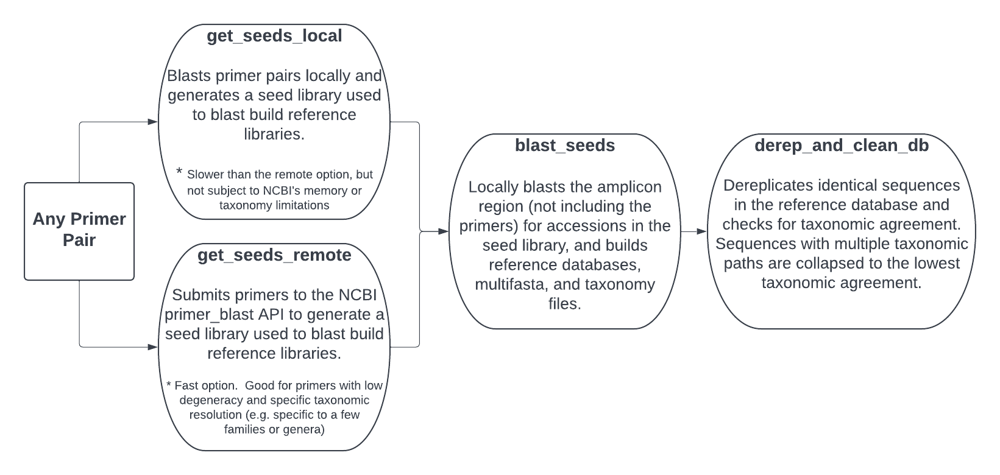
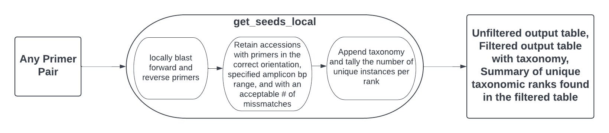
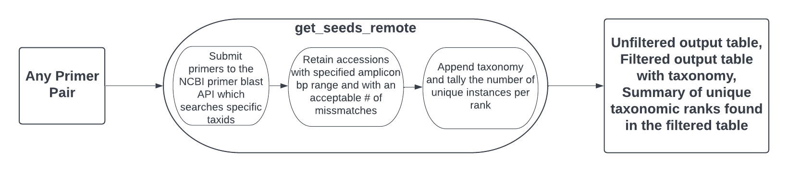
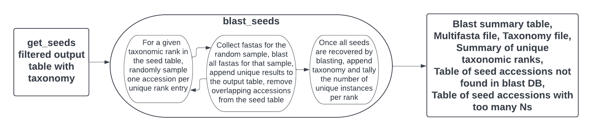
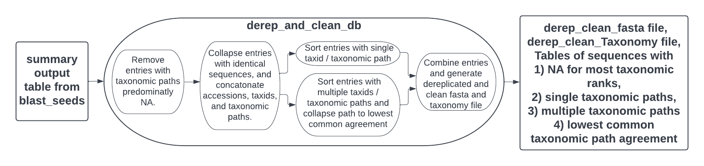

# rCRUX: Generate CRUX metabarcoding reference libraries in R


**Authors:** [Luna Gal](<https://github.com/LunaGal>), [Zachary Gold](<https://github.com/zjgold>), [Ramon Gallego](https://github.com/ramongallego), [Emily Curd](<https://github.com/limey-bean>)<br/>
**Inspiration:**
The late, great [Jesse Gomer](<https://github.com/jessegomer?tab=repositories>). Coding extraordinaire and dear friend.<br/>
**License:**
[GPL-3](https://opensource.org/licenses/GPL-3.0) <br/>
**Support:**
Support for the development of this tool was provided by [CalCOFI](<https://calcofi.org/>), NOAA, and [VBRN](https://vbrn.org/). <br/>

eDNA metabarcoding is increasingly used to survey biological communities using common universal and novel genetic loci. There is a need for an easy to implement computational tool that can generate metabarcoding reference libraries for any locus, and are specific and comprehensive. We have reimagined CRUX [Curd et al. 2019](https://doi.org/10.1111/2041-210X.13214) and developed the rCRUX package to fit this need by generating taxonomy and fasta files for any user defined locus.  The typical workflow involves using get_seeds_local() or get_seeds_remote() to simulate *in silico* PCR to acquire a set of sequences analogous to PCR products containing metabarcode primer sequences.  The sequences or "seeds" recovered from the *in silico* PCR step are used to search databases for complementary sequence that lack one or both primers. This search step, blast_seeds() is used to iteratively align seed sequences against a local NCBI database for matches using a taxonomic rank based stratified random sampling approach.  This step results in a comprehensive database of primer specific reference barcode sequences from NCBI. Using derep_and_clean_db(), the database is de-replicated by DNA sequence where identical sequences are collapsed into a representative read. If there are multiple possible taxonomic paths for a read, the taxonomic path is collapsed to the lowest taxonomic agreement.


## Typical Workflow



## Installation

Install from GitHub:

``` r
# install.packages(devtools)
devtools::install_github("LunaGal/rCRUX")
```

``` r
library(rCRUX)
```

## Dependencies

**NOTE:** These only need to be downloaded once or as NCBI updates databases. rCRUX can access and successfully build metabarcode references using databases stored on external drives. </br>

### BLAST+

NCBI's [BLAST+](ftp://ftp.ncbi.nlm.nih.gov/blast/executables/blast+/) suite must be locally installed and accessible in the user's path. NCBI provides installation instructions for [Windows](https://www.ncbi.nlm.nih.gov/books/NBK52637/), [Linux](https://www.ncbi.nlm.nih.gov/books/NBK52640/), and [Mac OS](https://www.ncbi.nlm.nih.gov/books/NBK569861/). Version 2.10.1+ is verified compatible with rCRUX.

### Blast-formatted database

rCRUX requires a local blast-formatted nucleotide database. These can be user generated or download a pre-formatted database from [NCBI](https://ftp.ncbi.nlm.nih.gov/blast/db/).  NCBI provides a tool (perl script) for downloading databases as part of the blast+ package. A brief help page can be found [here](https://www.ncbi.nlm.nih.gov/books/NBK569850/).

The following shell script can be used to download the blast-formatted nucleotide database.

```
mkdir NCBI_blast_nt
cd NCBI_blast_nt
wget ftp://ftp.ncbi.nlm.nih.gov/blast/db/nt*
time for file in *.tar.gz; do tar -zxvf $file; done
cd ..

```

You can test your nt blast database using the following command:

```
blastdbcmd -db '/Users/limeybean/Dropbox/CRUX_2.0/ncbi_nt/nt' -dbtype nucl -entry MN937193.1 -range 499-633
```
If you do not get the following, something went wrong in the build.

```
>MN937193.1:499-633 Jaydia carinatus mitochondrion, complete genome
TTAGATACCCCACTATGCCTAGTCTTAAACCTAGATAGAACCCTACCTATTCTATCCGCCCGGGTACTACGAGCACCAGC
TTAAAACCCAAAGGACTTGGCGGCGCTTCACACCCACCTAGAGGAGCCTGTTCTA
```

Possible error include but are not limited to:
1. Partial downloads of database files. Extracting each TAR archive (e.g. nt.00.tar.gz.md5) should cresult in 8 files with the following extensions(.nhd, .nhi, .nhr, .nin, .nnd, .nni, .nog, and .nsq).  If a few archives fail during download, you can redownload and unpack those that failed. You do not have to redownload all archives.  

2. You downloaded and built a blast database from ncbi fasta files but did not specify -parse_seqids


The nt database is **~242 GB** (as of 8/31/22) and can take several hours (overnight) to build. Loss of internet connection can lead to partially downloaded files and blastn errors (see above).

### Taxonomizr

rCRUX uses the [taxonomizr](https://cran.r-project.org/web/packages/taxonomizr/vignettes/usage.html) package for taxonomic assignment based on NCBI [Taxonomy id's \(taxids\)](https://www.ncbi.nlm.nih.gov/). Many rCRUX functions require a path to a local taxonomizr readable sqlite database. This database can be built using taxonomizr's [prepareDatabase](https://www.rdocumentation.org/packages/taxonomizr/versions/0.8.0/topics/prepareDatabase) function.

This database is **~72 GB** (as of 8/31/22) and can take several hours (overnight) to build. Loss of internet connection can lead to partially downloaded files and taxonomizr run errors.

The following code can be used to build this database:

```
library(taxonomizr)

accession_taxa_sql_path <- "/my/accessionTaxa.sql"
prepareDatabase(accession_taxa_sql_path)

```

**Note:** For poor bandwidth connections, please see the [taxononmizr readme for manual installation](https://cran.r-project.org/web/packages/taxonomizr/readme/README.html) of the accessionTaxa.sql database. If built manually, make sure to delete any files other than the accessionTaxa.sql database (e.g. keeping nucl_gb.accession2taxid.gz leads to a warning message).

# Example pipeline

The following example shows a simple rCRUX pipeline from start to finish. Note that this example will require internet access and considerable database storage (~**314 GB**, see section above), run time (mainly for blastn), and system resources to execute.

**Note:** Blast databases and the taxonomic assignment databases (accessionTaxa.sql) can be stored on external hard drive. It increases run time, but is a good option if computer storage capacity is limited.

There are two options to generate seeds for the database generating blast step blast_seeds_local() or blast_seeds_remote(). The local option is slower, however it is not subject to the memory limitations of using the NCBI primer_blast API. The local option is recommended if the user is building a large database, wants to include any taxid in the search, and has many degenerate sites in their primer set.

## get_seeds_local()

This example uses default parameters, with the exception of evalue, to minimize run time.

```
output_directory_path <- "/my/directory/12S_V5F1_local_111122_e300" #path to desired output directory

metabarcode_name <- "12S_V5F1" # desired name of metabarcode locus

accession_taxa_sql_path <- "/my/directory/accessionTaxa.sql"

forward_primer_seq = "TAGAACAGGCTCCTCTAG"

reverse_primer_seq =  "TTAGATACCCCACTATGC"

blast_db_path <- "/my/directory/ncbi_nt/nt"


get_seeds_local(forward_primer_seq,
                 reverse_primer_seq,
                 output_directory_path,
                 metabarcode_name,
                 accession_taxa_sql_path,
                 blast_db_path, evalue = 300)

```

Two output .csv files are automatically created at this path based on the arguments passed to get_seeds_local.  One includes all unfiltered output the other is filtered based on user defined parameters and includes taxonomy.

A unique taxonomic rank summary file is also generated (e.g. the number of unique phyla, class, etc in the blast hits). If a taxonomic rank category contains NA's, they will be counted as a single unique rank. Sequence availability in NCBI for a given taxid is a limiting factor.


**If BLAST+ is not in your path do the following:**


```

get_seeds_local(forward_primer_seq,
                 reverse_primer_seq,
                 output_directory_path,
                 metabarcode_name,
                 accession_taxa_sql_path,
                 blast_db_path, evalue = 300,
                 ncbi_bin = "/my/directory/blast+_folder")


```


## get_seeds_remote()

This example uses default parameters to minimize run time.

Searching jawless vertebrates (taxid: "1476529") and jawed vertebrates (taxid: "7776").

```
output_directory_path <- "/my/directory/12S_V5F1_remote_111122" #path to desired output directory

metabarcode_name <- "12S_V5F1" # desired name of metabarcode locus

accession_taxa_sql_path <- "/my/directory/accessionTaxa.sql"

forward_primer_seq = "TAGAACAGGCTCCTCTAG"

reverse_primer_seq =  "TTAGATACCCCACTATGC"


get_seeds_remote(forward_primer_seq,
          reverse_primer_seq,
          output_directory_path,
          metabarcode_name,
          accession_taxa_sql_path,
          organism = c("1476529", "7776"),
          return_table = FALSE)

```

**Note:** When using default parameters only 1047 hits are returned from NCBI's primer blast (as of 9-25-22). Returns hit sizes and contents are variable depending on parameters, random blast sampling, and database updates.

Two output .csv files are automatically created at this path based on the arguments passed to get_seeds_remote.  One includes all unfiltered output the other is filtered based on user defined parameters and includes taxonomy.

A unique taxonomic rank summary file is also generated (e.g. the number of unique phyla, class, etc in the blast hits). If a taxonomic rank category contains NA's, they will be counted as a single unique rank, inflating the true count.

Sequence availability in NCBI for a given taxid is a limiting factor, as are degenerate bases and API memory allocation.

[Modifying defaults can increase the number of returns by orders of magnitude.](#Search-options)


## blast_seeds()


Iterative searches are based on a stratified random sampling unique taxonomic groups for a given rank from the get_seeds_local or get_seeds_remote output table. For example, the default is to randomly sample one read from each genus.  The user can select any taxonomic rank present in the get_seeds_local output table. The number of seeds selected may cause blastn to exceed the users available RAM, and for that reason the user can choose the maximum number of reads to blast at one time (max_to_blast, default = 1000). blast_seeds will subsample each set of seeds based on max_to_blast and process all seeds before starting a new search for seeds to blast.


```
seeds_output_path <- '/my/directory/12S_V5F1_remote_111122/12S_V5F1_filtered_get_seeds_remote_output_with_taxonomy.csv'
# this is output from get_seeds_local or get_seeds_remote

blast_db_path <- "/my/directory/blast_database/nt"

accession_taxa_sql_path <- "/my/directory/accessionTaxa.sql"

output_directory_path <- '/my/directory/12S_V5F1_remote_111122/'

metabarcode_name <- "12S_V5F1"


blast_seeds(seeds_output_path,
            blast_db_path,
            accession_taxa_sql_path,
            output_directory_path,
            metabarcode_name)    
```


**Note:** After each round of blast, the system state is saved. If the script is terminated after a full round of blast, the user can pick up where they left off. The user can also change parameters at this point (e.g. change the max_to_blast or rank)

The output includes a summary table of all unique blast hits (summary.csv), a multi fasta file of all unique hits (metabarcode_name_.fasta), a taxonomy file of all unique hits (metabarcode_name_taxonomy.txt), a unique taxonomic rank summary file (metabarcode_name_taxonomic_rank_counts.txt), a list of all of the accessions not present in your blast database (e.g. relevant if you ran get_seeds_remote; blastdbcmd_failed.csv), and a list of accessions with 4 or more Ns in a row (default for that parameter is wildcards = "NNNN"; too_many_ns.csv). The default number of reads to blast per rank is 1 (default for that parameter is sample_size = 1). The script will error out if the user asks for more reads per rank than exist in the blast seeds table.     


**If BLAST+ is not in your path do the following**


```
blast_seeds(seeds_output_path,
            blast_db_path,
            accession_taxa_sql_path,
            output_directory_path,
            metabarcode_name,
            ncbi_bin = "/my/directory/blast+_folder")


```

Example output can be found [here](/examples/12S_V5F1_generated_11-10-22).

**Note:** There will be variability between runs due to primer blast return parameters and random sampling of the blast seeds table that occurs during blast_seeds. However, variability can be decreased by changing parameters (e.g. randomly sampling species rather than genus will decrease run to run variability).

## derep_and_clean_db()


This function takes the output of blast_seeds and de-replicates identical sequences and collapses ambiguous taxonomy to generate a clean reference database.

```
summary_path <- "/my/directory/12S_V5F1_remote_111122/blast_seeds_output/summary.csv"
# this is the output from blast_seeds

derep_and_clean_db(output_directory_path, summary_path, metabarcode_name)


```

**Note:** Accessions with the same sequence are collapsed into a representative sequence. If those accessions have different taxids (taxonomic paths), we determine the lowest taxonomic agreement across the multiple accessions with an identical sequence. For example, for the MiFish 12S locus, nearly all rockfishes in the genus *Sebastes* have identical sequences. Instead of including ~110 identical reference sequences, one for each individual species, we report a single representative sequence with a lowest common taxonomic agreement of the genus *Sebastes*. This prevents classification bias for taxa with more sequences and also provides accurate taxonomic resolution within the reference database.

We exclude all sequences with taxids that are NA. Such sequences are not immediately useful for classification of metabarcoding sequences. However, we caution that such results can be indicative of off target amplification of a given primer set. For example, the MiFish 12S primer set amplifies uncultured marine bacteria among other taxa (taxid = NA) indicating off target amplification of non-fish taxa. These sequences are saved in the References_with_NA_for_taxonomic_ranks.csv file.

The result of this function is a final clean reference database file set composed of a paired metabarcode_name_derep_and_clean.fasta and metabarcode_name_derep_and_clean_taxonomy.txt. A summary file of the number of unique taxonomic ranks is also generated: metabarcode_name_derep_and_clean_unique_taxonomic_rank_counts.txt. In addition, all representative sequences and associated accessions are saved in Sequences_with_lowest_common_taxonomic_path_agreement.csv, Sequences_with_mostly_NA_taxonomic_paths.csv,
Sequences_with_multiple_taxonomic_paths.csv, and
Sequences_with_single_taxonomic_path.csv files. These files allow for the traceback of representative sequences to multiple accessions.


Example output can be found [here](/examples/12S_V5F1_generated_11-10-22).

# Detailed Explanation For The Major Functions
## [get_seeds_local](https://lunagal.github.io/get_seeds_local)



### Overview
[get_seeds_local](https://lunagal.github.io/get_seeds_local) takes a set of forward and reverse primer sequences and generates csv summaries of data returned from a locally run adaptation of [NCBI's primer blast](https://www.ncbi.nlm.nih.gov/tools/primer-blast/) to find possible full length barcode sequence containing forward and reverse primer matches. It also generates a count of unique instances of taxonomic ranks (Phylum, Class, Order, Family, Genus, and Species).

This script is a local interpretation of [get_seeds_remote](https://lunagal.github.io/get_seeds_remote) that avoids querying NCBI's [primer BLAST](https://www.ncbi.nlm.nih.gov/tools/primer-blast/) tool. Although it is slower than remotely generating blast seeds, it is not subject to the arbitrary throttling of jobs that require significant memory.

### Specific Output
It creates a `get_seeds_local` directory at `output_directory_path` if one doesn't yet exist, then creates a subdirectory inside `output_directory_path` named after `metabarcode_name`. It creates three files inside that directory. One represents the unfiltered output and another represents the output after filtering with user modifiable parameters and with appended taxonomy. Also generated is a summary of unique taxonomic ranks after filtering.

### Detailed Steps
get_seeds_local passes the forward and reverse primer sequence for a given PCR product to [run_primer_blastn](https://lunagal.github.io/run_primer_blastn). run_primer_blastn takes the primer fasta file, and individually queries them against a blast formatted database using the task "blastn_short". The result is an output table with the following columns of data: qseqid (query subject id), sgi (subject gi), saccver (subject accession version), mismatch (number of mismatches between the subject a query), sstart (subject start), send (subject end), staxids (subject taxids).

The returned blast hits for each sequence are matched and checked to see if they generate plausible amplicon (e.g. amplify the same accession and are in the correct orientation to produce a PCR product). These hits are written to a file with the suffix `_unfiltered_get_seeds_local_output.csv`.  These hits are further filtered for length and number of mismatches.

Taxonomy is appended to these filtered hits using [get_taxonomizr_from_accession](https://lunagal.github.io/get_taxonomizr_from_accession). The results are written to to file with the suffix `_filtered_get_seeds_local_output_with_taxonomy.csv`. The number of unique instances for each rank in the taxonomic path for the filtered hits are tallied (NAs are counted once per rank) and written to a file with the suffix `_filtered_get_seeds_local_unique_taxonomic_rank_counts.txt`.

**Note:**
Information about the blastn parameters can be found in run_primer_blast, and by accessing blastn -help in your terminal.  Default parameters were optimized to provide results similar to that generated through remote blast via primer-blast as implemented in [iterative_primer_search](https://lunagal.github.io/iterative_primer_search) and [modifiedPrimerTree_Functions](https://lunagal.github.io/modifiedPrimerTree_Functions). The number of alignments returned for a given blast search is hardcoded at "-num_alignments", "10000000",


### Parameters
**forward_primer_seq**
+ passed to primer_to_fasta, which turns it into fasta
        file to be past to get_seeds_local.
+       e.g. forward_primer_seq <- "TAGAACAGGCTCCTCTAG"
**reverse_primer_seq**
+ passed to primer_to_fasta, which turns it into fasta
        file to be past to get_seeds_local.
+       e.g. reverse_primer_seq <-  "TTAGATACCCCACTATGC"
**output_directory_path**
+ the parent directory to place the data in.
+       e.g. "/path/to/output/12S_V5F1_local_111122_e300_111122"
**metabarcode_name**
+ used to name the subdirectory and the files. If a
        directory named metabarcode_name does not exist in output_directory_path, a
        new directory will be created. get_seeds_local appends
        metabarcode_name to the beginning of each of the files it
        generates.
+       e.g. metabarcode_name <- "12S_V5F1"
**accession_taxa_sql_path**
+ the path to sql database created by taxonomizr
+       e.g. accession_taxa_sql_path <- "/my/accessionTaxa.sql"
**mismatch**
+ the highest acceptable mismatch value per hit. get_seeds_local removes each
        row with a mismatch greater than the specified value.
+       The default is mismatch = 6
**minimum_length**
+ get_seeds_local removes each row that has a value less than
        minimum_length in the product_length column.
+       The default is minimum_length = 5
**maximum_length**
+ get_seeds_local removes each row that has a
        value greater than maximum_length in the product_length column.
+       The default is maximum_length = 500
**blast_db_path**
+ a directory with a blast-formatted database.
+       e.g blast_db_path <- "/my/ncbi_nt/nt"
**task**
+ passed to [run_primer_blastn](https://lunagal.github.io/run_primer_blastn) the task for blastn to
        perform - default here is "blastn_short", which is optimized
        for searches with queries < 50 bp
**word_size**
+ passed to [run_primer_blastn](https://lunagal.github.io/run_primer_blastn) is the fragment size
        used for blastn search - smaller word sizes increase sensitivity and
        time of the search.
+       The default is word_size =  7
**evalue**
+ passed to [run_primer_blastn](https://lunagal.github.io/run_primer_blastn) is the number of
        expected hits with a similar quality score found by chance.
+       The default is evalue = 3e-7
**coverage**
+ passed to [run_primer_blastn](https://lunagal.github.io/run_primer_blastn) is the minimum
        percent of the query length recovered in the subject hits.
+       The default is coverage = 90
**perID**
+ passed to [run_primer_blastn](https://lunagal.github.io/run_primer_blastn) is the minimum percent
        identity of the query relative to the subject hits.
+       The default is perID = 2
**reward**
+ passed to [run_primer_blastn](https://lunagal.github.io/run_primer_blastn) is the reward for
        nucleotide match.
+       The default is reward = 2
**ncbi_bin**
+ passed to [run_primer_blastn](https://lunagal.github.io/run_primer_blastn) is the path to blast+
        tools if not in the user's path.  Specify only if blastn and is not in
        your path.
+       The default is ncbi_bin = NULL
+       if not specified in path do the following: ncbi_bin = "/my/local/blast+_folder".

### Example
```
forward_primer_seq = "TAGAACAGGCTCCTCTAG"
reverse_primer_seq =  "TTAGATACCCCACTATGC"
output_directory_path <- "/my/directory/12S_V5F1_local_111122_species_750"
metabarcode_name <- "12S_V5F1" # desired name of metabarcode locus
accession_taxa_sql_path <- "/my/directory/accessionTaxa.sql"
blast_db_path <- "/my/directory/ncbi_nt/nt"

get_seeds_local(forward_primer_seq,
                reverse_primer_seq,
                output_directory_path,
                metabarcode_name,
                accession_taxa_sql_path,
                blast_db_path, rank = species, max_to_blast = 750)

# using the rank of species will increase the number of total unique blast hits
# modifying the max_to_blast submits fewer reads simultaneously and reduces overall RAM while extending the run
```


## [get_seeds_remote](https://lunagal.github.io/get_seeds_remote)



### Overview

[get_seeds_remote](https://lunagal.github.io/get_seeds_remote) takes a set of forward and reverse primer sequences and generates csv summaries of [NCBI's primer blast](https://www.ncbi.nlm.nih.gov/tools/primer-blast/) data returns. Only full length barcode sequences containing primer matches are captured. It also generates a count of unique instances of taxonomic ranks (Phylum, Class, Order, Family, Genus, and Species) captured in the seed library.

This script uses [iterative_primer_search](https://lunagal.github.io/iterative_primer_search) to perform tasks. Its parameters are very similar to primerTree's primer_search(), but it takes vectors for organism and for database and performs a primer search for each combination. For each combination it calls [modifiedPrimerTree_Functions](https://lunagal.github.io/modifiedPrimerTree_Functions), which is a modified versions of primerTree's primer_search() and primerTree's parse_primer, to query NCBI's [primer BLAST](https://www.ncbi.nlm.nih.gov/tools/primer-blast/) tool, filters the results, and aggregates them into a single data.frame.

It downgrades errors from primer_search and parse_primer_hits into warnings. This is useful when searching for a large number of different combinations, allowing the function to output successful results.

### Specific Output
It creates a directory `get_seeds_remote` in the `output_directory_path`. It creates three files inside that directory. One represents the unfiltered output and another represents the output after filtering with user modifiable parameters and with appended taxonomy. Also generated is a summary of unique taxonomic ranks after filtering.


### Detailed Steps

get_seeds_remote passes the forward and reverse primer sequence for a given
PCR product to [iterative_primer_search](https://lunagal.github.io/iterative_primer_search) along with the taxid(s) of
the organism(s) to blast, the database to search, and many additional possible
parameters to NCBI's primer blast tool (see Note below). Degenerate primers
are converted into all possible non degenerate sets and a user defined maximum
number of primer combinations is passed to to the API using [modifiedPrimerTree_Functions](https://lunagal.github.io/modifiedPrimerTree_Functions). Multiple taxids are
searched independently, as are multiple database searches (e.g. c('nt', 'refseq_representative_genomes'). The data are parsed and stored in a dataframe, which are also written to a file with the suffix
`_unfiltered_get_seeds_remote_output.csv`.

These hits are further filtered using [filter_primer_hits](https://lunagal.github.io/filter_primer_hits) to
calculate and append amplicon size to the dataframe. Only hits that pass with default
or user modified length and number of mismatches parameters are retained.

Taxonomy is appended to these filtered hits using
[get_taxonomizr_from_accession](https://lunagal.github.io/get_taxonomizr_from_accession). The results are written to
to file with the suffix `_filtered_get_seeds_remote_output_with_taxonomy.csv`.
The number of unique instances for each rank in the taxonomic path for the
filtered hits are tallied (NAs are counted once per rank) and written to a
file with the suffix `_filtered_get_seeds_local_remote_taxonomic_rank_counts.txt`

**Notes:**
get_seeds_remote passes many parameters to NCBI's primer blast tool. See below for more information.

primer BLAST defaults to homo sapiens, so it is important that you supply a specific organism or organisms. NCBI's taxids can be found [here](https://www.ncbi.nlm.nih.gov/taxonomy). You can specify multiple organism by passing a character vector containing each of the options, like in the example below.

Often NCBI API will throttle higher taxonomic ranks (Domain, Phylum, etc.). One work around is to supply multiple lower level taxonomic ranks (Class, Family level, etc.) or use get_seeds_local.

### Parameters

**forward_primer_seq**
+ passed to primer_search, which turns it into a list of
        each primer it could be based on its degenerate primers, then passes
        each one in turn to NCBI.
+       e.g. forward_primer_seq <- "TAGAACAGGCTCCTCTAG"
**reverse_primer_seq**
+ passed to primer_search, which turns it into a list of
        each primer it could be based on its degenerate primers, then passes
        each one in turn to NCBI.
+        e.g. reverse_primer_seq <-  "TTAGATACCCCACTATGC"
**output_directory_path**
+ the parent directory to place the data in.
+        e.g. "/path/to/output/12S_V5F1_remote_111122"
**metabarcode_name**
+ used to name the subdirectory and the files. If a
        directory named metabarcode_name does not exist in output_directory_path, a
        new directory will be created. get_seeds_remote appends
        metabarcode_name to the beginning of each of the two files it generates.
+       e.g. metabarcode_name <- "12S_V5F1"
**accession_taxa_sql_path**
+ the path to sql created by taxonomizr
+         e.g. accession_taxa_sql_path <- "/my/accessionTaxa.sql"
**organism**
+ a vector of character vectors. Each character vector is
        passed in turn to primer_search, which passes them to NCBI.
        get_seeds_remote aggregates all of the results into a single file
+       e.g. organism = c("1476529", "7776"))
+       Note: increasing taxonomic rank (e.g. increasing from order to class) for this parameter can maximize primer hits, but can also lead to API run throttling due to memory limitations
**num_permutations**
+ the number of primer permutations to search, if the
        degenerate bases cause more than this number of permutations to exist,
        this number will be sampled from all possible permutations.
+       The default is num_permutations = 50  
+       Note for very degenerate bases, searches may be empty due to poor mutual matches for a given forward and reverse primer combination.
**mismatch**
+ the highest acceptable mismatch value. parse_primer_hits
        returns a table with a mismatch column. get_seeds_remote removes each
        row with a mismatch greater than the specified value.
+       The default is mismatch = 3
+       Note: this is smaller than get_seeds_local because of differences in mismatch calculation between function.
**minimum_length**
+ parse_primer_hits returns a table with a product_length
        column. get_seeds_remote removes each row that has a value less than
        minimum_length in the product_length column.
+       The default is minimum_length = 5
**maximum_length**
+ parse_primer_hits returns a table with a
        product_length column. get_seeds_remote removes each row that has a
        value greater than maximum_length in the product_length column
+       The default is maximum_length = 500
**primer_specificity_database**
+ passed to primer_search, which passes it to NCBI.  
+       The default is primer_specificity_database = 'nt'.
**HITSIZE**
+ a primer BLAST search parameter set high to maximize the
        number of observations returned.
+       The default HITSIZE = 50000
+       Note: increasing this parameter can maximize primer hits, but can also lead to API run throttling due to memory limitations
**NUM_TARGETS_WITH_PRIMERS**
+ a primer BLAST search parameter set high to
        maximize the number of observations returned.
+       The default is NCBI NUM_TARGETS_WITH_PRIMERS = 1000
+       Note: increasing this parameter can maximize primer hits, but can also lead to API run throttling due to memory limitations
**...**
+ additional arguments passed to [modifiedPrimerTree_Functions](https://lunagal.github.io/modifiedPrimerTree_Functions). See [NCBI primer-blast tool]](https://www.ncbi.nlm.nih.gov/tools/primer-blast/) for more information.


**Check NCBI's primer blast for additional search options**

get_seeds_remote passes many parameters to NCBI's primer blast tool. You can match the parameters to the fields available in the GUI here. First, use your browser to view the page source. Search for the field you are interested in by searching for the title of the field. It should be enclosed in a tag. Inside the label tag, it says for = "<name_of_parameter>". Copy the string after for = and add it to get_seeds_remote as the name of a parameter, setting it equal to whatever you like.

| Name                                   |       Default  |
|----------------------------------------|----------------|
| PRIMER_SPECIFICITY_DATABASE            | nt             |
| EXCLUDE_ENV                            | unchecked      |
| ORGANISM                               | Homo sapiens   |
| TOTAL_PRIMER_SPECIFICITY_MISMATCH      | 1              |
| PRIMER_3END_SPECIFICITY_MISMATCH       | 1              |
| TOTAL_MISMATCH_IGNORE                  | 6              |
| MAX_TARGET_SIZE                        | 4000           |
| HITSIZE                                | 50000          |
| EVALUE                                 | 30000          |
| WORD_SIZE                              | 7              |
| NUM_TARGETS_WITH_PRIMERS               | 1000           |
| MAX_TARGET_PER_TEMPLATE                | 100            |

As of 2022-08-16, the primer blast GUI contains some options that are not implemented by primer_search. The [table below](#Table-of-available-options) documents available options.

You can check [primerblast](https://www.ncbi.nlm.nih.gov/tools/primer-blast/) for more information on how to modify search options. For example, if want you to generate a larger hitsize, open the source of the primer designing tool and look for that string. You find the following:

```
<label for="HITSIZE" class="m ">Max number of sequences returned by Blast</label>
         <div class="input ">
                      <span class="sel si">
                      <select name="HITSIZE" id="HITSIZE" class= "opts checkDef" defVal="50000" >
                        <option  value="10">10</option>
                        <option  value="50">50</option>
                        <option  value="100">100</option>
                        <option  value ="250">250</option>
                        <option  value="500">500</option>
                        <option  value="1000">1000</option>
                        <option  value="10000">10000</option>
                        <option selected="selected"  value="50000">50000</option>
                        <option  value="100000">100000</option>
                      </select>                       
                    </span>
                    <a class="helplink hiding" title="help" id="hitsizeHelp" href="#"><i class="fas fa-question-circle"></i> <span class="usa-sr-only">Help</span></a>
                    <p toggle="hitsizeHelp" class="helpbox hidden">
                      Maximum number of database sequences (with unique sequence identifier) Blast finds for primer-blast to screen for primer pair specificities. Note that the actual number of similarity regions (or the number of hits) may be much larger than this (for example, there may be a large number of hits on a single target sequence such as a chromosome).   Choose a higher value if you need to perform more stringent search.
                    </p>      

```
You can find the description and suggested values for this search option. HITSIZE ='1000000' is added to the search below along with several options that increase the number of entries returned from primer_search.


### Example
```
forward_primer_seq = "TAGAACAGGCTCCTCTAG"
reverse_primer_seq =  "TTAGATACCCCACTATGC"
output_directory_path <- "/my/directory/12S_V5F1_remote_111122_modified_params"
metabarcode_name <- "12S_V5F1"
accession_taxa_sql_path <- "/my/directory/accessionTaxa.sql"
blast_db_path <- "/my/directory/ncbi_nt/nt"
accession_taxa_sql_path <- "/my/directory/accession2taxid/accessionTaxa.sql"

get_seeds_remote(forward_primer_seq,
                reverse_primer_seq,
                output_directory_path,
                metabarcode_name,
                accession_taxa_sql_path,
                HITSIZE ='1000000',
                evalue='100000',
                word_size='6',
                MAX_TARGET_PER_TEMPLATE = '5',
                NUM_TARGETS_WITH_PRIMERS ='500000', minimum_length = 50,
                MAX_TARGET_SIZE = 200,
                organism = c("1476529", "7776"), return_table = FALSE)

# This results in approximately 111500 blast seed returns (there is some variation due to database updates, etc.), note the default generated approximately 1047.
# This assumes the user is not throttled by memory limitations.              
```


### [blast_seeds](https://lunagal.github.io/blast_seeds)



blast_seeds uses the entries generated by get_seeds_remote or get_seeds_local and the nucleotide-nucleotide matching of blastn to generate a .csv of NCBI database entries that match a sequence found in the get_seeds_local or get_seeds_remote step.

blast_seeds is a wrapper function that passes data to blast_datatable. blast_seeds handles the creation of a hidden save directory and an output directory and writes a .csv summarizing the results of blast_datatable (summary.csv).  It also generates a multi fasta file and corresponding a taxonomy file for all recovered hits (metabarcode_name_.fasta and metabarcode_name_taxonomy.txt). A unique taxonomic rank summary file (same format as the get blast seeds output file, metabarcode_name_taxonomic_rank_counts.txt), a list of all of the accessions not present in your blast database (blastdbcmd_failed.csv), and a list of accessions with 4 or more Ns in a row (too_many_ns.csv).

Internally, blast_datatable iteratively samples rows from the table of blast seeds, calls blastdbcmd on each accession number, and uses blastn to build a table of nucleotide matches. It samples by drawing random indices from a list of unsampled indices and examining the rows at those indices. Specifically, it randomly samples single indices from unique instances of a taxonomic rank (e.g. one accession number per genus). Depending on the number of seeds to be processed in each iteration, the next step may be run on subsamples of the seed set.

blast_datatable passes those seeds to run_blastdbcmd, which extracts the accession number, forward stop, and reverse stop, then uses them as arguments for blastdbcmd. blastdbcmd outputs a fasta, which blast_datatable aggregates into a multi-fasta character vector. blast_datatable purges any entry that has more than a specified number of Ns or did not return a result, recording those indices and accessions. When it has finished building the mutli-fasta vector, it passes it to blastn, which returns every nucleotide sequence that matches a sequence in the file. run_blastn parses the blastn output into a data.frame, and blast_datatable adds that data.frame to its output.

After each iteration, the accessions recovered through blastn are removed from the table of blast seeds. Then the process is repeated until every row is sampled. However, once the number of seeds in the table reaches the max_to_blast parameter, all remaining seeds will be treated as a set of blast seeds.  

After all blast seeds are processed, taxonomizr is used to add taxonomic data to the data.frame based on the accession numbers. The final output is the aggregate of all blastn calls with the taxonomic data added.

### [derep_and_clean_db](https://lunagal.github.io/derep_and_clean_db)



## Funding

The [CalCOFI](https://calcofi.org/) program provided funding support for this project.

## Acknowledgments

This work benefited from the amazing input of many including Lenore Pipes, Sarah Stinson, Gaurav Kandlikar, and Maura Palacios Mejia.

## References

<div id="refs" class="references csl-bib-body hanging-indent">

<div id="ref-Curdetal.2019" class="csl-entry">

Curd, E.E., Gold, Z., Kandlikar, G.S., Gomer, J., Ogden, M., O'Connell, T.,
Pipes, L., Schweizer, T.M., Rabichow, L., Lin, M. and Shi, B., 2019.
Anacapa Toolkit: An environmental DNA toolkit for processing multilocus
metabarcode datasets. Methods in Ecology and Evolution, 10(9), pp.1469-1475.
<https://doi.org/10.1111/2041-210X.13214>.

</div>

<div id="ref-next" class="csl-entry">


</div>

</div>
